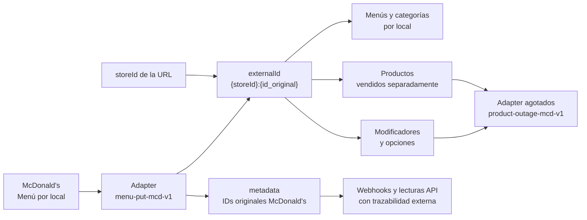

<Warning>
  Esta página no está listada en la navegación pública. Úsala solo para la integración McDonald's.
</Warning>

## Endpoint

```http
PUT /v3/adapters/menu-put-mcd-v1/stores/{storeId}
```

## Autenticación

Envía el API key como bearer token.

```http
Authorization: Bearer <API_KEY>
Content-Type: application/json
```

El API key debe tener permisos `admin` y acceso al local indicado en `storeId`. No envíes `auth_token` en el body.

## Comportamiento

- La llamada carga el menú completo de McDonald's para el local indicado en `{storeId}`.
- Cada local mantiene su propio menú, productos, categorías, modificadores y opciones.
- Si un producto u opción deja de venir en el payload, se deja no disponible solo para los menús del local importado.
- Las categorías se mantienen separadas por local.
- Los items vendidos separadamente se publican como productos.
- Los items usados dentro de grupos de modificadores se publican como opciones de modificador.

## Campos raíz

| Campo | Tipo | Requerido | Uso |
| --- | --- | --- | --- |
| `menus` | `array<Menu>` | Sí | Lista de menús a importar. Cada menú genera o actualiza un menú/precio Justo con `externalId = {storeId}:{app_menu_id}`. |
| `categories` | `array<Category>` | Sí | Catálogo de categorías referenciables por los menús. Solo se importan las categorías usadas por cada menú. |
| `items` | `array<Item>` | Sí | Catálogo completo de productos y opciones. Los items con `is_sold_separately: true` se importan como productos; los items referenciados por grupos de modificadores se importan como opciones. |
| `modifier_groups` | `array<ModifierGroup>` | Sí | Grupos de modificadores. Solo se importan los grupos referenciados por productos vendidos separadamente. |
| `display_options` | `DisplayOptions` | No | Opciones visuales del origen. Actualmente se aceptan pero no cambian el menú Justo. |

## `menus[]`

| Campo | Tipo | Requerido | Uso |
| --- | --- | --- | --- |
| `app_menu_id` | `string` | Sí | Identificador del menú McDonald's. Se usa para construir `externalId = {storeId}:{app_menu_id}` y queda guardado sin prefijo en `metadata.id`. |
| `menu_name` | `string` | Sí | Nombre base del menú/precio Justo. Justo guarda el menú como `{menu_name} ({storeId})` para identificar el local en el admin. |
| `app_category_ids` | `array<string>` | Sí | Categorías que componen el menú, en orden de visualización. Define qué categorías, productos y modificadores entran en la carga. |

## `categories[]`

| Campo | Tipo | Requerido | Uso |
| --- | --- | --- | --- |
| `app_category_id` | `string` | Sí | Identificador de la categoría McDonald's. Se usa para construir `externalId = {storeId}:{app_category_id}` y queda guardado sin prefijo en `metadata.id`. |
| `category_name` | `string` | Sí | Nombre de la categoría Justo. |
| `head_img` | `string` | No | URL de imagen. Si viene, se guarda como imagen de la categoría. |
| `app_item_ids` | `array<string>` | Sí | Items contenidos en la categoría, en orden de visualización. Solo los items con `is_sold_separately: true` se convierten en productos visibles. |

### Orden de categorías y productos

El adapter respeta el orden de los arrays recibidos:

- Las categorías se ordenan según `menus[].app_category_ids`.
- Los productos visibles se ordenan según `categories[].app_item_ids`.

Justo guarda una sola prioridad por producto. Si el mismo producto aparece en más de una categoría con posiciones distintas, se usa la primera aparición según el orden del menú y de sus categorías.

## `items[]`

| Campo | Tipo | Requerido | Uso |
| --- | --- | --- | --- |
| `app_item_id` | `string` | Sí | Identificador del item McDonald's. Se usa para construir `externalId = {storeId}:{app_item_id}` y queda guardado sin prefijo en `metadata.id`. |
| `item_name` | `string` | Sí | Nombre del producto u opción. Se usa como `name` e `internalName` cuando aplica. |
| `short_desc` | `string` | No | Descripción del producto Justo. En opciones de modificador se acepta, pero no se expone como descripción principal. |
| `sold_info_intl` | `array<SoldInfo>` | No | Horarios de venta del origen. Actualmente se aceptan pero no se transforman a horarios Justo. |
| `head_img` | `string` | No | URL de imagen. Si viene, se agrega como primera imagen del producto u opción. |
| `price` | `number` | No | Precio final del producto u opción. Si no viene, se usa `0`. |
| `original_price` | `number` | No | Precio original o tachado del producto. Solo aplica a productos visibles (`is_sold_separately: true`) y se usa cuando es mayor que `price`. En opciones de modificador se ignora. |
| `status` | `number` | No | Disponibilidad del origen. `1` se importa como disponible; cualquier otro valor se importa como no disponible. |
| `is_sold_separately` | `boolean` | No | Si es `true`, el item puede convertirse en producto visible si está en una categoría del menú. Si es `false`, normalmente se usa como opción de modificador. |
| `as_modifier_max_quantity` | `number` | No | Máximo de unidades seleccionables cuando el item se importa como opción de modificador. Si no viene, Justo usa `1`. Ejemplo: una opción `Extra: Queso` puede enviar `2` para permitir pedir dos quesos dentro del mismo grupo. |
| `app_modifier_group_ids` | `array<string>` | No | Grupos de modificadores asociados al producto. Se convierten a `modifiersExternalIds` con prefijo `{storeId}:`. |

### Ejemplo de precio tachado

`price` representa el precio final que paga el cliente. Si McDonald's necesita mostrar un precio tachado, puede enviar `original_price` con el precio original del producto.

```json
{
  "app_item_id": "PRODUCT-BIG-MAC",
  "item_name": "Big Mac",
  "price": 3990,
  "original_price": 4990,
  "status": 1,
  "is_sold_separately": true
}
```

En este caso Justo guarda `4990` como precio base/tachado y `3990` como precio final. Si `original_price` no viene, es igual o menor que `price`, se ignora.

## `items[].sold_info_intl[]`

| Campo | Tipo | Requerido | Uso |
| --- | --- | --- | --- |
| `time` | `array<TimeRange>` | No | Rangos horarios del origen. Se acepta, pero actualmente no modifica disponibilidad en Justo. |
| `day` | `array<number>` | No | Días del origen. Se acepta sin transformación. |
| `specialDay` | `array<unknown>` | No | Días especiales del origen. Se acepta sin transformación. |

## `items[].sold_info_intl[].time[]`

| Campo | Tipo | Requerido | Uso |
| --- | --- | --- | --- |
| `begin` | `string` | No | Hora de inicio en formato `HH:mm`. |
| `end` | `string` | No | Hora de término en formato `HH:mm`. |

## `modifier_groups[]`

| Campo | Tipo | Requerido | Uso |
| --- | --- | --- | --- |
| `app_modifier_group_id` | `string` | Sí | Identificador del grupo McDonald's. Se usa para construir `externalId = {storeId}:{app_modifier_group_id}` y queda guardado sin prefijo en `metadata.id`. |
| `modifier_group_name` | `string` | Sí | Nombre, nombre corto e internal name del modificador Justo. |
| `is_required` | `number` | No | Define si el grupo es obligatorio. `1` se importa como obligatorio; cualquier otro valor se importa como opcional. |
| `quantity_min_permitted` | `number` | No | Mínimo de opciones seleccionables. Si no viene, se usa `0`. |
| `quantity_max_permitted` | `number` | No | Máximo de opciones seleccionables. Si no viene, se usa `0`. |
| `app_mg_items` | `array<ModifierGroupItem>` | No | Opciones del grupo. Cada `app_item_id` debe existir en `items` para importarse como opción. |

## `modifier_groups[].app_mg_items[]`

| Campo | Tipo | Requerido | Uso |
| --- | --- | --- | --- |
| `app_item_id` | `string` | Sí | Referencia a un item de `items`. Ese item se transforma en opción del modificador. |

### Ejemplo de máximo por opción

En Justo, `quantity_max_permitted` limita cuántas opciones se pueden elegir dentro del grupo completo. `as_modifier_max_quantity` limita cuántas unidades se pueden elegir de una opción específica.

```json
{
  "items": [
    {
      "app_item_id": "PRODUCT-BIG-MAC",
      "item_name": "Big Mac",
      "price": 18.9,
      "status": 1,
      "is_sold_separately": true,
      "app_modifier_group_ids": ["GROUP-EXTRAS"]
    },
    {
      "app_item_id": "OPTION-EXTRA-CHEESE",
      "item_name": "Extra: Queso",
      "price": 1.5,
      "status": 1,
      "is_sold_separately": false,
      "as_modifier_max_quantity": 2
    },
    {
      "app_item_id": "OPTION-EXTRA-MEAT",
      "item_name": "Extra: Carne",
      "price": 5,
      "status": 1,
      "is_sold_separately": false,
      "as_modifier_max_quantity": 2
    }
  ],
  "modifier_groups": [
    {
      "app_modifier_group_id": "GROUP-EXTRAS",
      "modifier_group_name": "Extras",
      "is_required": 2,
      "quantity_min_permitted": 0,
      "quantity_max_permitted": 3,
      "app_mg_items": [
        {"app_item_id": "OPTION-EXTRA-CHEESE"},
        {"app_item_id": "OPTION-EXTRA-MEAT"}
      ]
    }
  ]
}
```

Con este ejemplo, el grupo `Extras` permite seleccionar hasta 3 unidades en total, por ejemplo 2 quesos y 1 carne.

## `display_options`

| Campo | Tipo | Requerido | Uso |
| --- | --- | --- | --- |
| `disable_item_instructions` | `boolean` | No | Opción visual del origen. Actualmente se acepta pero no cambia el menú Justo. |

## Ejemplo

```bash
curl -X PUT \
  "https://api.service.getjusto.com/v3/adapters/menu-put-mcd-v1/stores/{storeId}" \
  -H "Authorization: Bearer <API_KEY>" \
  -H "Content-Type: application/json" \
  --data-binary @catalogo-local.json
```

## Detalles internos de integración

Esta sección describe cómo Justo mantiene la trazabilidad y la separación de datos por local.

### Identificación

Justo identifica las entidades de McDonald's concatenando el local con el identificador original:

```txt
{storeId}:{id_original_mcdonalds}
```

Ese `externalId` se usa para crear, actualizar o eliminar items sin mezclar datos entre locales. Si el identificador original contiene `:`, se conserva completo; Justo separa el local usando solo el primer `:` del `externalId`.

Los campos originales que McDonald's necesita para trazabilidad quedan guardados en `metadata` junto con el `storeId` de Justo. El ID original se guarda sin el prefijo del local.

```json
{
  "adapter": "mcd",
  "storeId": "Ehj8ytLrkSeKs6TAq",
  "type": "item",
  "id": "CHO-26915-42065"
}
```

### Flujo de integración



### Criterios de transformación

| Caso McDonald's | Qué hace Justo |
| --- | --- |
| El catálogo viene por local, pero Justo normalmente modela menú por marca. | El adapter antepone `{storeId}:` a cada identificador y crea entidades independientes por local. |
| Los SKUs pueden repetirse entre locales. | El `externalId` queda como `{storeId}:{id_original}`, evitando colisiones entre locales. |
| El identificador original puede contener `:`. | Justo separa usando solo el primer `:`; el resto queda como parte del ID original. |
| McDonald's necesita conservar sus IDs originales. | El `externalId` se usa para operar; el ID original sin prefijo queda en `metadata.id`. |
| Las opciones de modificador vienen dentro de `items`. | El adapter detecta si el item es producto visible u opción de modificador según su uso en categorías y modifier groups. |
| Hay cargas incrementales por local. | Los productos u opciones ausentes quedan no disponibles solo dentro de los menús del local importado, no en otros locales. |

### Transformación del menú

| Origen McDonald's | Destino Justo |
| --- | --- |
| `menus[].app_menu_id` | `menu.externalId = {storeId}:{app_menu_id}` |
| `menus[].app_menu_id` | `menu.metadata = {adapter: "mcd", storeId, type: "menu", id: app_menu_id}` |
| `menus[].menu_name` | `menu.name = "{menu_name} ({storeId})"` |
| `categories[].app_category_id` | `category.externalId = {storeId}:{app_category_id}` |
| `categories[].app_category_id` | `category.metadata = {adapter: "mcd", storeId, type: "category", id: app_category_id}` |
| `categories[].category_name` | `category.name` |
| `items[].app_item_id` con `is_sold_separately: true` | `product.externalId = {storeId}:{app_item_id}` |
| `items[].app_item_id` con `is_sold_separately: true` | `product.metadata = {adapter: "mcd", storeId, type: "item", id: app_item_id}` |
| `items[].app_item_id` usado como opción | `option.externalId = {storeId}:{app_item_id}` |
| `items[].app_item_id` usado como opción | `option.metadata = {adapter: "mcd", storeId, type: "item", id: app_item_id}` |
| `items[].short_desc` | `product.description` |
| `items[].price` | Precio del producto u opción en el menú importado |
| `items[].price` | `priceMetadata = {adapter: "mcd", storeId, type: "itemPrice", id: app_item_id}` |
| `items[].status` | `available = status === 1` |
| `items[].as_modifier_max_quantity` | `option.max` cuando el item se importa como opción de modificador; si no viene se usa `1` |
| `items[].head_img` | Primera imagen del producto u opción |
| `items[].app_modifier_group_ids` | Modificadores del producto |
| `modifier_groups[].app_modifier_group_id` | `modifier.externalId = {storeId}:{app_modifier_group_id}` |
| `modifier_groups[].app_modifier_group_id` | `modifier.metadata = {adapter: "mcd", storeId, type: "modifier_group", id: app_modifier_group_id}` |
| `modifier_groups[].app_mg_items[].app_item_id` | Opciones del modificador |
