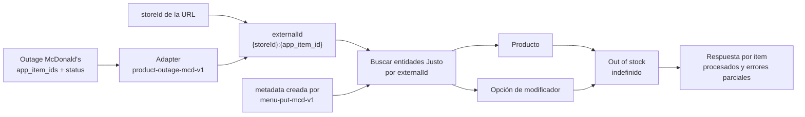

<Warning>
  Esta página no está listada en la navegación pública. Úsala solo para la integración McDonald's.
</Warning>

## Endpoint

```http
POST /v3/adapters/product-outage-mcd-v1/stores/{storeId}
```

## Autenticación

Envía el API key como bearer token.

```http
Authorization: Bearer <API_KEY>
Content-Type: application/json
```

El API key debe tener permisos `admin` y acceso al local indicado en `storeId`. No envíes `auth_token` en el body.

## Comportamiento

- El cambio aplica solo al local indicado en `{storeId}`.
- `status: 2` marca los items como agotados indefinidamente.
- `status: 1` marca los items como disponibles y elimina el agotado temporal.
- La operación acepta múltiples items en una sola llamada.
- Si un `app_item_id` corresponde a un producto Justo, se actualiza el producto.
- Si un `app_item_id` corresponde a una opción de modificador Justo, se actualizan todas las opciones con ese `externalId`.
- Si un item no existe en Justo, la respuesta lo incluye en `errors` y continúa procesando el resto.

## Campos raíz

| Campo | Tipo | Requerido | Uso |
| --- | --- | --- | --- |
| `app_item_ids` | `array<string>` | Sí | Lista de IDs originales McDonald's a actualizar. Se resuelven en Justo como `{storeId}:{app_item_id}`. |
| `status` | `number` | Sí | Estado de disponibilidad. `2` significa agotado; `1` significa disponible. |

## `status`

| Valor | Resultado |
| --- | --- |
| `2` | Crea o actualiza un agotado temporal indefinido (`until: none`). |
| `1` | Elimina el agotado temporal del producto u opción y lo deja disponible. |

## Ejemplo para agotar

```json
{
  "app_item_ids": [
    "RAW-1000426",
    "480 @ADSA-PE-PILOTO SP1-800240",
    "CHO-26935-42159"
  ],
  "status": 2
}
```

```bash
curl -X POST \
  "https://api.service.getjusto.com/v3/adapters/product-outage-mcd-v1/stores/{storeId}" \
  -H "Authorization: Bearer <API_KEY>" \
  -H "Content-Type: application/json" \
  --data-binary @outage.json
```

## Respuesta

```json
{
  "success": true,
  "data": {
    "adapter": "product-outage-mcd-v1",
    "storeId": "vN2A6s5TasNM73zrg",
    "status": 2,
    "outOfStock": true,
    "items": [
      {
        "appItemId": "CHO-26935-42159",
        "externalId": "vN2A6s5TasNM73zrg:CHO-26935-42159",
        "outOfStock": true,
        "productIds": [],
        "modifierOptionIds": ["abc123"],
        "outOfStockItemIds": ["oos123"]
      }
    ],
    "errors": []
  }
}
```

## Errores parciales

Si un item no existe en Justo, se reporta en `errors`:

```json
{
  "appItemId": "RAW-1000426",
  "externalId": "vN2A6s5TasNM73zrg:RAW-1000426",
  "message": "Item not found"
}
```

Los errores parciales no detienen la operación completa. Los demás items válidos se procesan normalmente.

## Detalles internos de integración

Esta sección describe cómo Justo ubica productos y opciones del menú importado.

### Identificación

Justo resuelve cada item concatenando el local con el identificador original:

```txt
{storeId}:{app_item_id}
```

Ese `externalId` permite agotar o liberar productos y opciones sin mezclar datos entre locales. Si el identificador original contiene `:`, se conserva completo; Justo separa el local usando solo el primer `:` del `externalId`.

Los campos originales que McDonald's necesita para trazabilidad quedan guardados en `metadata` durante la importación de menú. El adapter de agotados usa esos `externalId` ya creados para ubicar productos u opciones.

### Flujo de integración



### Criterios de transformación

| Caso McDonald's | Qué hace Justo |
| --- | --- |
| El agotado viene por local. | El `storeId` de la URL se usa para resolver cada item como `{storeId}:{app_item_id}`. |
| El mismo `app_item_id` puede existir en otro local. | Solo se modifica el producto u opción cuyo `externalId` empieza con el `storeId` recibido. |
| El `app_item_id` puede contener `:`. | Justo separa usando solo el primer `:` del `externalId`; el ID original se mantiene completo. |
| McDonald's manda opciones como si fueran productos. | El adapter busca tanto productos como opciones de modificador con el mismo `externalId`. |
| `status: 2` significa agotado temporal, pero sin fecha final. | Justo crea un agotado indefinido. |
| Pueden venir varios items en el mismo payload. | Se procesan todos; si alguno no existe, queda en `errors` y los demás siguen. |
