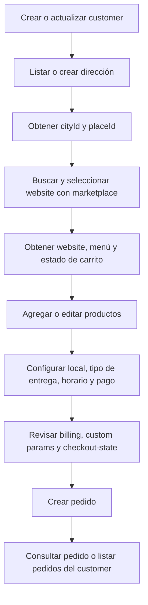

Esta guía describe el flujo completo para construir un checkout externo con Ordering API, desde la identificación del customer hasta la creación del pedido.

Todas las llamadas usan `Authorization: Bearer <token>` con scope `orderingApi`. El customer se identifica con `externalCustomerId`; ese ID pertenece a la app autenticada y no se comparte con otras apps.

<Tip>
Usa siempre los valores retornados por Ordering API para `cityId`, `placeId`, `domain`, `websiteId`, `menuId`, `storeId`, `time`, productos, modificadores y medios de pago. Evita hardcodear valores calculados por Justo.
</Tip>

## Flujo



## 1. Crear o actualizar customer

Crea el customer antes de armar el carrito. Esto permite reutilizar direcciones y mantener datos reales de contacto por app.

```http
PUT /v3/ordering/customers/{externalCustomerId}
```

Envía `email`, `phone`, `firstName` y `lastName` cuando estén disponibles. El email real no se usa como identidad técnica del usuario interno; Ordering API lo guarda separado y lo copia en `Order.email` al crear la orden.

```json
{
  "email": "cliente@correo.com",
  "phone": "+56912345678",
  "firstName": "Cliente",
  "lastName": "Demo"
}
```

## 2. Dirección, cityId y placeId

Para delivery, la app debe trabajar con una dirección normalizada. Primero lista direcciones existentes del customer y reutiliza una si corresponde.

```http
GET /v3/ordering/customers/{externalCustomerId}/addresses
```

Si no hay una dirección adecuada, créala:

```http
POST /v3/ordering/customers/{externalCustomerId}/addresses
```

```json
{
  "placeId": "place-id",
  "address": "Av. Providencia 123",
  "addressLine2": "Depto 402",
  "location": {
    "lat": -33.43219757080078,
    "lng": -70.59982299804688
  },
  "acceptsNoLine2": false,
  "comment": "Tocar timbre"
}
```

La dirección entrega el `placeId` y datos normalizados para cobertura. El `cityId` lo debe resolver tu app desde su selector de ciudad o geocoding externo y usarlo en marketplace. Para `go` o `serve`, puedes omitir dirección, pero igual debes seleccionar un local compatible.

Cuando ya conozcas el website elegido, selecciona la dirección para ese website:

```http
PUT /v3/ordering/customers/{externalCustomerId}/websites/{domain}/selected-address
```

```json
{
  "addressId": "addressId"
}
```

Esto guarda `selectedAddressId` en checkout-state y actualiza el `placeId` usado por el carrito.

## 3. Seleccionar website con marketplace

Usa marketplace para mostrar comercios disponibles según ciudad, dirección y búsqueda.

```http
GET /v3/ordering/marketplace/recommendations?cityId={cityId}&placeId={placeId}
GET /v3/ordering/marketplace/search?cityId={cityId}&placeId={placeId}&query={query}
```

Cada resultado incluye datos del comercio, `websiteId`, `storeId`, `baseURL`, cobertura y tiempos estimados. Para continuar el checkout necesitas el `domain` canónico del website, sin protocolo ni `www.`.

```text
Correcto: pedrojuangutierrez.getjusto.com
Evitar: https://www.pedrojuangutierrez.getjusto.com/
```

Después de que el customer elige un comercio, carga sus datos públicos:

```http
GET /v3/ordering/websites/{domain}
```

## 4. Obtener menú y estado del carro

Obtén el menú del website antes de mostrar productos. Si omites `menuId`, Ordering API usa el menú por defecto del website.

```http
GET /v3/ordering/websites/{domain}/categories?menuId={menuId}
GET /v3/ordering/websites/{domain}/products?menuId={menuId}
GET /v3/ordering/websites/{domain}/products/search?menuId={menuId}&query={query}
GET /v3/ordering/websites/{domain}/products/{productId}?menuId={menuId}
```

Para catálogos grandes, parte con búsqueda o categorías y carga el detalle solo cuando el customer abre un producto. El detalle trae `availabilityAt`, `maxPurchaseQuantity` y `modifiers`.

Lee también el estado inicial del carrito:

```http
GET /v3/ordering/customers/{externalCustomerId}/websites/{domain}/cart
```

La respuesta `OrderingCartState` contiene preferencias, dirección seleccionada, local, horarios, medios de pago y carrito calculado cuando ya hay items.

## 5. Agregar o editar productos

Antes de agregar un producto, valida:

- `availabilityAt.available` debe ser `true`.
- `amount` no debe superar `maxPurchaseQuantity`, si existe.
- Cada modificador obligatorio debe cumplir `min` y `max`.
- No envíes opciones con `availabilityAt.available: false`.
- Si una opción tiene `requiresModifierOptionIds`, selecciónala solo cuando las opciones requeridas ya estén elegidas.

```http
POST /v3/ordering/customers/{externalCustomerId}/websites/{domain}/cart/items
PATCH /v3/ordering/customers/{externalCustomerId}/websites/{domain}/cart/items/{cartItemId}
DELETE /v3/ordering/customers/{externalCustomerId}/websites/{domain}/cart/items/{cartItemId}
```

```json
{
  "productId": "productId",
  "menuId": "menuId",
  "amount": 1,
  "comment": "Sin cebolla",
  "modifiers": [
    {
      "modifierId": "modifierId",
      "optionsIds": ["optionId1", "optionId2"]
    }
  ]
}
```

Después de agregar o actualizar un item, usa `data.state.cart.items` para guardar el `cartItemId` real y mostrar precios calculados. No recalcules totales solo en cliente.

## 6. Configurar local, entrega, horario y pago

Guarda las decisiones estables del carrito en preferencias.

```http
PATCH /v3/ordering/customers/{externalCustomerId}/websites/{domain}/cart/preferences
```

```json
{
  "deliveryType": "delivery",
  "storeId": "storeId",
  "menuId": "menuId",
  "paymentType": "cash",
  "time": "now",
  "couponCode": "PROMO10",
  "websiteCoinsToSpend": 1000,
  "justoCoinsToSpend": 500
}
```

Para delivery, selecciona dirección antes de listar locales. Para retiro o consumo en local, consulta locales y elige uno que acepte el tipo de entrega.

```http
GET /v3/ordering/customers/{externalCustomerId}/websites/{domain}/cart/stores
```

Consulta horarios después de definir `deliveryType`, `storeId` y, para delivery, dirección:

```http
GET /v3/ordering/customers/{externalCustomerId}/websites/{domain}/cart/times
```

Envía en `time` exactamente el `value` retornado. Puede ser `now` o un valor programado.

Consulta medios de pago después de seleccionar local y tipo de entrega:

```http
GET /v3/ordering/customers/{externalCustomerId}/websites/{domain}/cart/payment-methods
```

Envía `paymentType` con el `paymentMethod` retornado. Si usas tarjeta guardada o subtipo de pago, envía `cardId` y `otherPaymentType` por separado.

Después de cada cambio importante, vuelve a leer el carrito:

```http
GET /v3/ordering/customers/{externalCustomerId}/websites/{domain}/cart
```

Usa esa respuesta como fuente de verdad para `itemsPrice`, `deliveryFee`, `serviceFee`, `calculatedTipAmount`, `totalPrice`, `amountToPay`, `couponStatus` y beneficios.

## 7. Revisar billing, custom params y estado temporal

Antes de crear el pedido, revisa si el website exige facturación:

```http
GET /v3/ordering/websites/{domain}/billing-params
```

`billingParamsSchema` es dinámico. Si `orderBillingRequired` es `true`, guarda billing antes de crear la orden.

```http
PUT /v3/ordering/customers/{externalCustomerId}/websites/{domain}/billing
```

```json
{
  "type": "invoice",
  "name": "Empresa SpA",
  "document": "76123456-7",
  "email": "facturacion@empresa.cl",
  "address": "Av. Siempre Viva 123",
  "activityType": "services"
}
```

Para campos propios del checkout, guarda `orderParams` en checkout-state o envíalos en `order.orderParams` al crear la orden. Estos campos se validan al crear el pedido según la configuración del website.

```http
PATCH /v3/ordering/customers/{externalCustomerId}/websites/{domain}/checkout-state
```

```json
{
  "selectedAddressId": "addressId",
  "cashAmount": 20000,
  "tip": {
    "amount": 1000
  },
  "orderParams": {
    "sourceChannel": "mobile",
    "marketingConsent": true
  },
  "termSignatures": [
    {
      "version": "terms-version"
    }
  ],
  "idempotencyKey": "checkout-123",
  "meta": {
    "externalOrderId": "external-order-123"
  }
}
```

Usa checkout-state para datos que no son parte estable del carrito: `selectedAddressId`, `billing`, `tip`, `cashAmount`, `gift`, `orderParams`, `termSignatures`, `idempotencyKey`, `meta` y datos equivalentes. Este estado expira automáticamente.

## 8. Crear pedido

Antes de llamar `POST /orders`, valida que:

- El customer exista y tenga email real si necesitas notificaciones.
- El carrito tenga items.
- No haya productos o modificadores no disponibles.
- `deliveryType`, `storeId`, `menuId`, `paymentType` y `time` estén definidos.
- Para delivery, exista `selectedAddressId`.
- Billing esté guardado si el website lo exige.
- Custom params y firmas requeridas estén en `orderParams` y `termSignatures`.
- `idempotencyKey` sea estable para reintentos del mismo checkout.

```http
POST /v3/ordering/customers/{externalCustomerId}/websites/{domain}/orders
```

```json
{
  "order": {
    "deliveryType": "delivery",
    "storeId": "storeId",
    "menuId": "menuId",
    "paymentType": "cash",
    "cashAmount": 20000,
    "time": "now",
    "tipAmount": 1000,
    "orderParams": {
      "sourceChannel": "mobile"
    },
    "idempotencyKey": "checkout-123",
    "meta": {
      "externalOrderId": "external-order-123"
    }
  }
}
```

Si omites campos como `storeId`, `menuId`, `deliveryType`, `paymentType`, `time`, `billing` o `idempotencyKey`, Ordering API intenta tomarlos desde preferencias del carrito o checkout-state.

El `idempotencyKey` debe ser el mismo en reintentos del mismo checkout y distinto para intentos nuevos. Las órdenes creadas por este endpoint siempre quedan asociadas a la app autenticada mediante `orderingAPIAppId`, se crean como órdenes marketplace y usan `embeddedVendor: orderingAPI`.

## 9. Consultar pedido

Después de crear el pedido, puedes leerlo por ID o listar pedidos del customer.

```http
GET /v3/ordering/orders/{orderId}
GET /v3/ordering/customers/{externalCustomerId}/orders
```

Una app solo puede leer las órdenes creadas por esa misma app.

## Propina

`cart.calculatedTipAmount` sirve como sugerencia calculada por Justo. Para crear la orden, envía la propina como monto final en `order.tipAmount` o guarda `checkout-state.tip.amount`.

```json
{
  "tip": {
    "amount": 1000
  }
}
```

Si tu app ofrece porcentajes, calcula el monto en cliente usando como base `itemsPriceWithoutDiscount` cuando exista, o `itemsPrice` como fallback. No envíes solo el porcentaje al crear la orden.

## Cupones y coins

Puedes aplicar `couponCode`, `websiteCoinsToSpend` y `justoCoinsToSpend` en preferencias del carrito. Luego lee el carrito y respeta `couponStatus`, `benefits` y `amountToPay`.

También puedes consultar balances:

```http
GET /v3/ordering/customers/{externalCustomerId}/websites/{domain}/website-coins
GET /v3/ordering/customers/{externalCustomerId}/websites/{domain}/justo-coins
```

## Errores comunes

- `notFound` en website: revisa que `domain` sea el dominio canónico.
- Sin comercios en marketplace: revisa `cityId`, `placeId` y cobertura.
- Sin locales disponibles: revisa `deliveryType`, dirección seleccionada y cobertura del `placeId`.
- Sin horarios: selecciona primero `storeId` y usa un local abierto para el tipo de entrega elegido.
- Producto no disponible: vuelve a leer el detalle del producto y valida `availabilityAt`.
- Modificadores inválidos: revisa `min`, `max`, opciones requeridas y disponibilidad de opciones.
- Billing requerido: revisa `billing-params` y guarda billing antes de crear el pedido.
- Custom params inválidos: revisa los campos esperados por el website y envíalos en `orderParams`.
- Total inesperado: usa siempre el carrito calculado como fuente de verdad para totales, fees, descuentos y propina.
