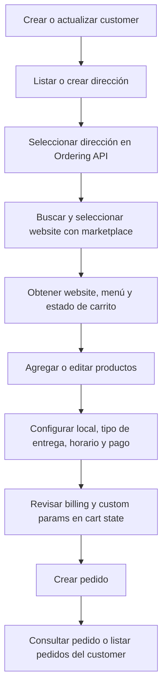

Esta guía describe el flujo completo para construir un checkout externo con Ordering API, desde la identificación del customer hasta la creación del pedido.

Todas las llamadas usan `Authorization: Bearer <token>` con scope `orderingApi`. El customer se identifica con `externalCustomerId`; ese ID pertenece a la app autenticada y no se comparte con otras apps.

<Tip>
Selecciona siempre una dirección del customer antes de marketplace, carrito u orden. Ordering API toma `cityId` y `placeId` desde esa dirección; no los envíes como parámetros configurables.
</Tip>

## Flujo



## 1. Crear o actualizar customer

Crea el customer antes de armar el carrito. Esto permite reutilizar direcciones y mantener datos reales de contacto por app.

```http
PUT /v3/ordering/customers/{externalCustomerId}
```

Envía `email`, `phone`, `firstName` y `lastName` cuando estén disponibles. El email real no se usa como identidad técnica del usuario interno; Ordering API lo guarda separado y lo copia en `Order.email` al crear la orden. Para pagos en efectivo o websites que exigen teléfono validado, envía `email` y `phone` reales en el customer; Ordering API los usa como snapshot del pedido y no requiere una sesión web del cliente.

```json
{
  "email": "cliente@correo.com",
  "phone": "+56912345678",
  "firstName": "Cliente",
  "lastName": "Demo"
}
```

## 2. Dirección y ubicación seleccionada

Para delivery, la app debe trabajar con una dirección normalizada. Primero lista direcciones existentes del customer y reutiliza una si corresponde.

```http
GET /v3/ordering/customers/{externalCustomerId}/addresses
```

Si no hay una dirección adecuada, créala:

```http
POST /v3/ordering/customers/{externalCustomerId}/addresses
```

```json
{
  "streetAddress": "Av. Providencia 123, Providencia",
  "countryCode": "CL",
  "extendedAddress": "Depto 402",
  "location": {
    "lat": -33.43219757080078,
    "lng": -70.59982299804688
  },
  "acceptsNoLine2": false,
  "comment": "Tocar timbre"
}
```

La dirección entrega el `placeId` y datos normalizados para cobertura. Cuando el servicio puede resolver `cityId`, Ordering API lo guarda junto a la dirección seleccionada. Para `go` o `serve`, puedes omitir dirección, pero igual debes seleccionar un local compatible.

Selecciona la dirección una vez para el customer:

```http
PUT /v3/ordering/customers/{externalCustomerId}/selected-address
```

```json
{
  "placeId": "placeId"
}
```

La selección queda guardada a nivel customer y app. No tienes que repetirla para cada website. Esto guarda `selectedAddressId`, `selectedPlaceId` y `selectedCityId` en el customer. Marketplace, catálogo, carrito y creación de orden usan esa dirección seleccionada internamente.

## 3. Seleccionar website con marketplace

Usa marketplace para mostrar comercios disponibles según la dirección seleccionada del customer. Estas rutas viven bajo el customer, por lo que Ordering API resuelve `cityId`, `placeId` y menú desde la dirección guardada y sus preferencias.

```http
GET /v3/ordering/customers/{externalCustomerId}/marketplace/recommendations
GET /v3/ordering/customers/{externalCustomerId}/marketplace/search?query={query}
```


Cada resultado incluye datos del comercio, `websiteId`, `storeId`, `baseURL`, cobertura y tiempos estimados. Para continuar el checkout necesitas el `domain` canónico del website, sin protocolo ni `www.`.

```text
Correcto: pedrojuangutierrez.getjusto.com
Evitar: https://www.pedrojuangutierrez.getjusto.com/
```

Después de que el customer elige un comercio, carga sus datos públicos:

```http
GET /v3/ordering/customers/{externalCustomerId}/websites/{domain}
```

## 4. Obtener menú y estado del carro

Obtén el catálogo del website antes de mostrar productos. Ordering API toma el `menuId` desde las preferences del customer. Si todavía no hay un menú guardado, usa el menú por defecto del website.

`/products` devuelve `products`, `categories` y `categoryTree`; úsalo como fuente única de catálogo y navegación.

```http
GET /v3/ordering/customers/{externalCustomerId}/websites/{domain}/products
GET /v3/ordering/customers/{externalCustomerId}/websites/{domain}/products/search?query={query}
GET /v3/ordering/customers/{externalCustomerId}/websites/{domain}/products/{productId}
```

Para catálogos grandes, parte con búsqueda o categorías y carga el detalle solo cuando el customer abre un producto. El detalle trae `availabilityAt`, `maxPurchaseQuantity` y `modifiers`.

Lee también el estado inicial del carrito:

```http
GET /v3/ordering/customers/{externalCustomerId}/websites/{domain}/cart
```

La respuesta de `GET /cart` es directamente el OrderPreferences calculado por el servicio preferences. Usa `data.address`, `data.store`, `data.website` y `data.cart` como fuente de verdad para dirección, local, website, medios de pago, horarios y totales.

Si el customer tiene una dirección seleccionada, Ordering API la aplica automáticamente al leer o recalcular el carrito. No envíes `cityId`, `placeId` ni `menuId`; Ordering API obtiene ubicación y menú internamente y devuelve el OrderPreferences ya resuelto.

## 5. Agregar o editar productos

Antes de agregar un producto, valida:

- `availabilityAt.available` debe ser `true`.
- `amount` no debe superar `maxPurchaseQuantity`, si existe.
- Cada modificador obligatorio debe cumplir `min` y `max`.
- No envíes opciones con `availabilityAt.available: false`.
- Si una opción tiene `requiresModifierOptionIds`, selecciónala solo cuando las opciones requeridas ya estén elegidas.

```http
POST /v3/ordering/customers/{externalCustomerId}/websites/{domain}/cart/items
PATCH /v3/ordering/customers/{externalCustomerId}/websites/{domain}/cart/items/{cartItemId}
DELETE /v3/ordering/customers/{externalCustomerId}/websites/{domain}/cart/items/{cartItemId}
```

```json
{
  "productId": "productId",
  "amount": 1,
  "comment": "Sin cebolla",
  "modifiers": [
    {
      "modifierId": "modifierId",
      "optionsIds": ["optionId1", "optionId2"]
    }
  ]
}
```

Después de agregar o actualizar un item, usa `data.item._id` y `data.state.cart.items` para guardar el `cartItemId` real y mostrar precios calculados. Si cambias comentario o modificadores, el `cartItemId` puede cambiar porque el carrito agrupa items equivalentes. No recalcules totales solo en cliente.

## 6. Configurar local, entrega, horario y pago

Guarda las decisiones estables del carrito en preferencias.

```http
PATCH /v3/ordering/customers/{externalCustomerId}/websites/{domain}/cart/preferences
```

```json
{
  "deliveryType": "delivery",
  "storeId": "storeId",
  "paymentType": "cash",
  "time": "now",
  "couponCode": "PROMO10"
}
```

Para delivery, selecciona una dirección del customer antes de listar locales. Para retiro o consumo en local, consulta locales y elige uno que acepte el tipo de entrega.

```http
GET /v3/ordering/customers/{externalCustomerId}/websites/{domain}/cart/stores
```

Después de definir `deliveryType`, `storeId` y, para delivery, dirección, lee `GET /cart`. Usa `data.store.availableScheduleDaysOptions` para elegir agenda y `data.store.availablePaymentMethods` para elegir `paymentType`. Si usas tarjeta guardada o subtipo de pago, envía `cardId` y `otherPaymentType` por separado.

Después de cada cambio importante, vuelve a leer el carrito:

```http
GET /v3/ordering/customers/{externalCustomerId}/websites/{domain}/cart
```

Usa esa respuesta como fuente de verdad para `itemsPrice`, `deliveryFee`, `serviceFee`, `calculatedTipAmount`, `totalPrice`, `amountToPay`, `couponStatus` y beneficios.

## 7. Revisar billing, custom params y estado temporal

Antes de crear el pedido, revisa si el website exige facturación:

Lee la configuración dinámica de billing desde `data.options.billing` en `GET /cart`. Si `data.options.billing.required` es `true`, guarda billing antes de crear la orden usando `PATCH /cart/preferences`.

```json
{
  "type": "invoice",
  "documentType": "rut",
  "documentId": "76123456-0",
  "legalName": "Empresa SpA",
  "businessActivities": "Servicios de tecnologia",
  "address": "Av. Siempre Viva 123",
  "district": "Providencia",
  "city": "Santiago",
  "emailReceptor": "facturacion@empresa.cl"
}
```

Para billing y campos propios del checkout, guarda `billing` y `orderParams` en `PATCH /cart/preferences` antes de crear la orden. `POST /orders` solo recibe `idempotencyKey`; estos campos se validan al crear el pedido según la configuración del website.

```http
PATCH /v3/ordering/customers/{externalCustomerId}/websites/{domain}/cart/preferences
```

```json
{
  "cashAmount": 20000,
  "tip": {
    "amount": 1000
  },
  "orderParams": {
    "sourceChannel": "mobile",
    "marketingConsent": true
  },
  "meta": {
    "externalOrderId": "external-order-123"
  }
}
```

Usa `PATCH /cart/preferences` para guardar parámetros de checkout como `billing`, `tip`, `cashAmount`, `gift`, `orderParams`, `meta` y datos equivalentes. No envíes `selectedAddressId`, `cityId` ni `placeId` en este endpoint; la dirección siempre sale del customer. Estos datos vuelven como campos directos en `GET /cart` (`data.billing`, `data.tip`, `data.orderParams`, etc.) y expiran automáticamente.

Antes de iniciar el flujo de compra, el integrador debe pedirle al usuario final que acepte los términos y condiciones de Justo. Para mostrar los términos del website seleccionado, usa [Términos y condiciones de Justo](https://proyectomica.getjusto.com/documentos-legales/termsAndConditions). Ordering API no muestra un checkbox propio dentro del checkout API.

## 8. Crear pedido

Antes de llamar `POST /orders`, valida que:

- El customer exista y tenga email real si necesitas notificaciones.
- El carrito tenga items.
- No haya productos o modificadores no disponibles.
- `deliveryType`, `storeId`, `paymentType` y `time` estén definidos en `orderPreferences`.
- Para delivery, exista una dirección seleccionada en el customer.
- Billing esté guardado si el website lo exige.
- Custom params estén en `orderParams` y el integrador ya haya obtenido la aceptación de términos del usuario final.
- `idempotencyKey` sea estable para reintentos del mismo checkout.

```http
POST /v3/ordering/customers/{externalCustomerId}/websites/{domain}/orders
```

Envía solo `idempotencyKey` en el body. Ordering API arma el pedido con:

- `idempotencyKey` desde el body de `POST /orders`.
- `storeId`, `deliveryType`, `paymentType`, `time`, `couponCode`, `cardId`, `dropOffType`, `tableName` y `menuId` desde OrderPreferences.
- `billing`, `tip`, `cashAmount`, `gift`, `orderParams`, `sessionBirthday` y `meta` desde `PATCH /cart/preferences`.
- Email, teléfono y nombre desde el customer guardado con `PUT /customers/{externalCustomerId}`.

```json
{
  "idempotencyKey": "checkout-123"
}
```

El `idempotencyKey` debe ser el mismo en reintentos del mismo checkout y distinto para intentos nuevos. Las órdenes creadas por este endpoint siempre quedan asociadas a la app autenticada mediante `orderingAPIAppId`, se crean como órdenes marketplace y usan `embeddedVendor: orderingAPI`.

## 9. Consultar pedido

Después de crear el pedido, puedes leerlo por ID o listar pedidos del customer.

```http
GET /v3/ordering/orders/{orderId}
GET /v3/ordering/customers/{externalCustomerId}/orders
```

Una app solo puede leer las órdenes creadas por esa misma app.

## Propina

`cart.calculatedTipAmount` sirve como sugerencia calculada por Justo. Guarda la propina final en `tip.amount` con `PATCH /cart/preferences`; `POST /orders` la toma desde ese state.

```json
{
  "tip": {
    "amount": 1000
  }
}
```

Si tu app ofrece porcentajes, calcula el monto en cliente usando como base `itemsPriceWithoutDiscount` cuando exista, o `itemsPrice` como fallback. No envíes solo el porcentaje al crear la orden.

## Cupones

Puedes aplicar `couponCode` en preferencias del carrito. Luego lee el carrito y respeta `couponStatus`, `benefits` y `amountToPay`.

## Errores comunes

- `notFound` en website: revisa que `domain` sea el dominio canónico.
- Sin comercios en marketplace: revisa que el customer tenga dirección seleccionada con `selectedPlaceId` y `selectedCityId`, y que esa dirección tenga cobertura.
- Sin locales disponibles: revisa `deliveryType`, dirección seleccionada y cobertura del `placeId`.
- Sin horarios: selecciona primero `storeId` y usa un local abierto para el tipo de entrega elegido.
- Producto no disponible: vuelve a leer el detalle del producto y valida `availabilityAt`.
- Modificadores inválidos: revisa `min`, `max`, opciones requeridas y disponibilidad de opciones.
- Billing requerido: revisa `data.options.billing.required` y guarda `billing` con `PATCH /cart/preferences` antes de crear el pedido.
- Teléfono requerido: si recibes `phone: requirePhoneVerification`, revisa que el customer tenga `email` y `phone` reales y que los estés enviando al crear la orden cuando actualices el customer en ese mismo paso.
- Custom params inválidos: revisa los campos esperados por el website y envíalos en `orderParams`.
- Total inesperado: usa siempre el carrito calculado como fuente de verdad para totales, fees, descuentos y propina.
