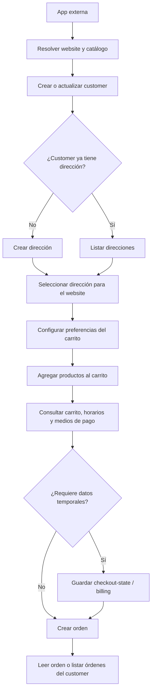

Este flujo muestra la secuencia mínima para que una app externa cree una orden marketplace usando Ordering API.

Todas las llamadas usan `Authorization: Bearer <token>` con scope `orderingApi`. El customer se identifica por `externalCustomerId`; ese ID es propio de cada app.

## Diagrama



## Secuencia recomendada

1. Buscar el comercio y el menú.

```http
GET /v3/ordering/websites/{domain}
GET /v3/ordering/websites/{domain}/categories?menuId={menuId}
GET /v3/ordering/websites/{domain}/products?menuId={menuId}
GET /v3/ordering/websites/{domain}/products/{productId}?menuId={menuId}
```

También puedes usar marketplace si la app necesita descubrir comercios:

```http
GET /v3/ordering/marketplace/recommendations?cityId={cityId}&placeId={placeId}
GET /v3/ordering/marketplace/search?cityId={cityId}&placeId={placeId}&query={query}
```

2. Crear o actualizar el customer.

```http
PUT /v3/ordering/customers/{externalCustomerId}
```

Envía `email`, `phone`, `firstName` y `lastName` cuando estén disponibles. El `email` se guarda como email real del customer y se copia en `Order.email` al crear la orden.

3. Crear o seleccionar dirección.

```http
GET /v3/ordering/customers/{externalCustomerId}/addresses
POST /v3/ordering/customers/{externalCustomerId}/addresses
PUT /v3/ordering/customers/{externalCustomerId}/websites/{domain}/selected-address
```

Para `delivery`, selecciona una dirección antes de crear la orden. Para `go` o `serve`, igual puedes omitir dirección si el checkout no la necesita.

4. Configurar preferencias del carrito.

```http
PATCH /v3/ordering/customers/{externalCustomerId}/websites/{domain}/cart/preferences
```

Usa este endpoint para guardar `storeId`, `menuId`, `deliveryType`, `paymentType`, `time`, `couponCode`, `cardId`, `cashAmount`, coins u otras preferencias del carrito.

5. Agregar productos.

```http
POST /v3/ordering/customers/{externalCustomerId}/websites/{domain}/cart/items
PATCH /v3/ordering/customers/{externalCustomerId}/websites/{domain}/cart/items/{cartItemId}
DELETE /v3/ordering/customers/{externalCustomerId}/websites/{domain}/cart/items/{cartItemId}
```

Cada item debe incluir `productId`, `menuId`, `amount` y, si aplica, `modifiers` y `comment`.

6. Validar estado calculado.

```http
GET /v3/ordering/customers/{externalCustomerId}/websites/{domain}/cart
GET /v3/ordering/customers/{externalCustomerId}/websites/{domain}/cart/stores
GET /v3/ordering/customers/{externalCustomerId}/websites/{domain}/cart/times
GET /v3/ordering/customers/{externalCustomerId}/websites/{domain}/cart/payment-methods
```

Usa la respuesta del carrito para mostrar totales, fees, beneficios, horarios y medios de pago disponibles antes de confirmar.

7. Guardar estado temporal de checkout si aplica.

```http
PATCH /v3/ordering/customers/{externalCustomerId}/websites/{domain}/checkout-state
PUT /v3/ordering/customers/{externalCustomerId}/websites/{domain}/billing
```

`checkout-state` sirve para datos que no viven en el carrito: `selectedAddressId`, `billing`, `tip`, `cashAmount`, `gift`, `orderParams`, `idempotencyKey`, `meta` y datos equivalentes. Este estado expira automáticamente.

8. Crear la orden.

```http
POST /v3/ordering/customers/{externalCustomerId}/websites/{domain}/orders
```

El body puede enviar `order` con los valores finales. Si omites campos como `storeId`, `menuId`, `deliveryType`, `paymentType`, `time`, `billing` o `idempotencyKey`, Ordering API intenta tomarlos desde preferencias del carrito o `checkout-state`.

```json
{
  "order": {
    "storeId": "storeId",
    "menuId": "menuId",
    "deliveryType": "go",
    "paymentType": "inStore",
    "time": "now",
    "idempotencyKey": "external-order-123",
    "meta": {
      "externalOrderId": "external-order-123"
    }
  }
}
```

Las órdenes creadas por este endpoint siempre quedan con ownership por `orderingAPIAppId`, `embeddedVendor: orderingAPI` y tipo marketplace.

9. Consultar la orden.

```http
GET /v3/ordering/orders/{orderId}
GET /v3/ordering/customers/{externalCustomerId}/orders
```

Una app solo puede leer las órdenes creadas por esa misma app.

## Campos críticos

- `externalCustomerId`: identificador del customer en la app externa. No se comparte entre apps.
- `domain`: dominio del website Justo.
- `placeId`: dirección normalizada usada para cobertura y cálculo de despacho.
- `storeId`: local que preparará el pedido.
- `menuId`: menú desde el que se agregan productos.
- `deliveryType`: `delivery`, `go` o `serve`.
- `paymentType`: medio de pago seleccionado.
- `time`: `now` o una opción retornada por `cart/times`.
- `idempotencyKey`: recomendado para evitar órdenes duplicadas ante reintentos.
